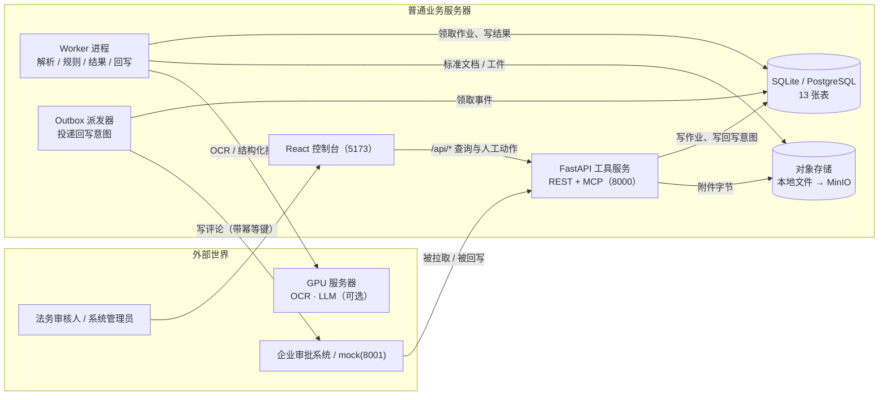
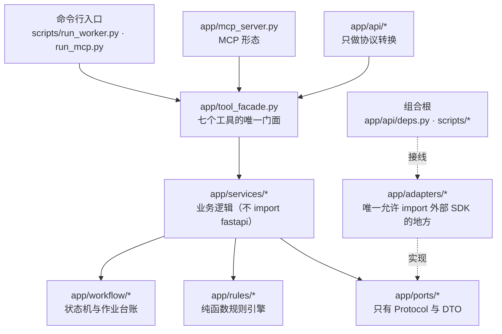
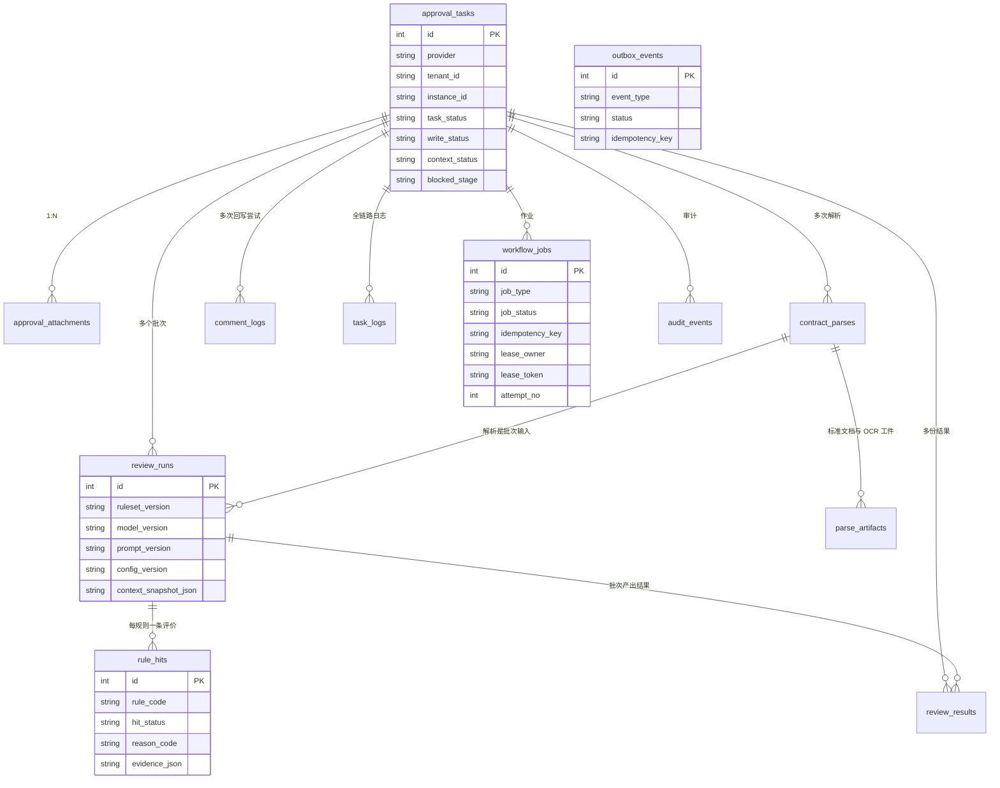
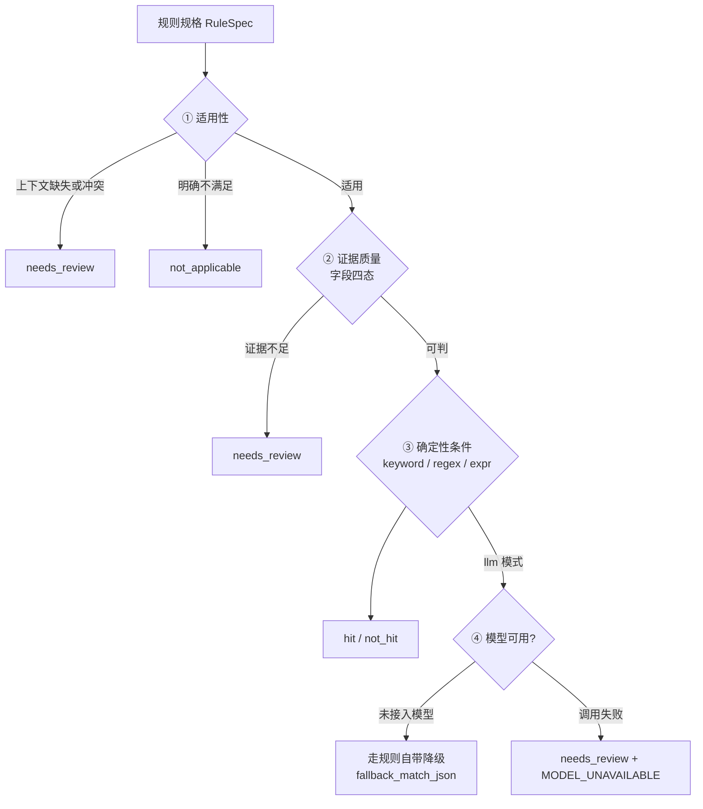
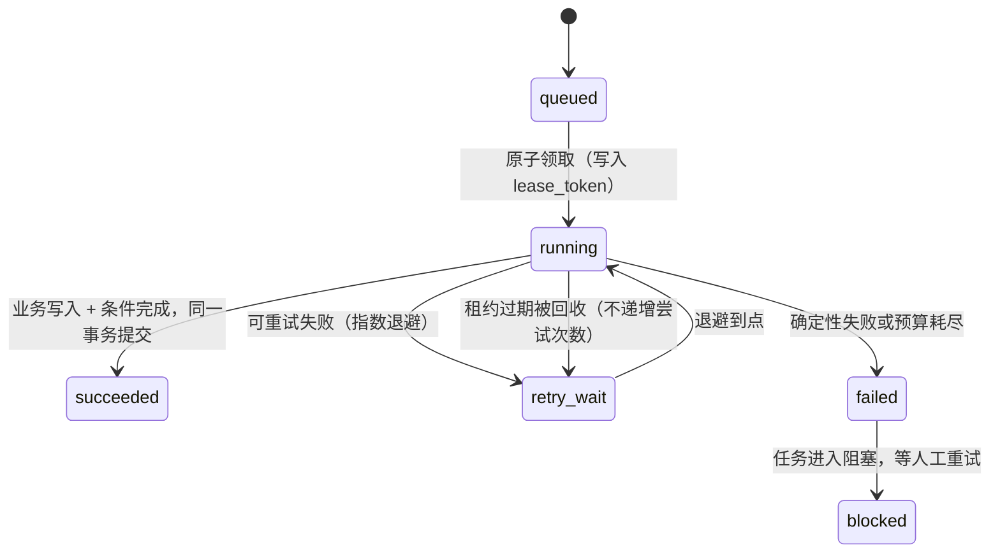
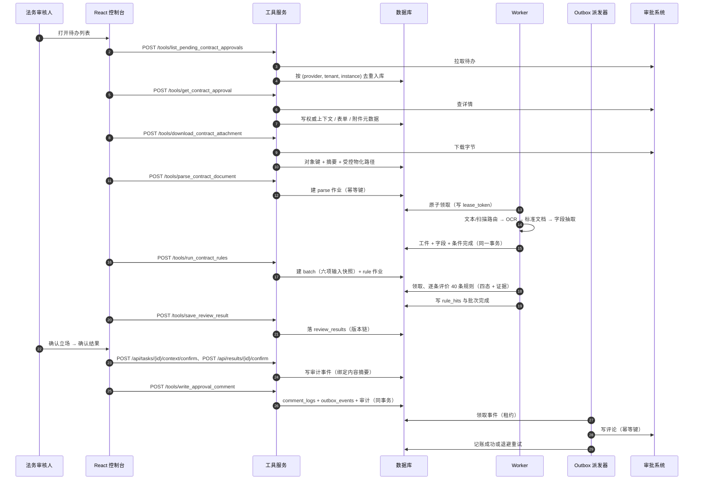

# 合同审批审查系统 —— 架构解析与企业级评估

> 生成日期：2026-09-16。
> 证据口径：本文所有"实测"数字都来自本次在同一台机器上重新执行的命令，
> 不引用历史文档里的旧数字。命令清单见 §11。

---

## 0. 一页速览

| 项目 | 内容 |
| --- | --- |
| 系统定位 | 面向企业合同审批场景的自动审查工具服务：AI 出证据，人做决定 |
| 交付形态 | FastAPI 工具服务（REST + MCP 双形态）+ 独立 Worker + Outbox 派发器 + React 控制台 + mock 审批系统 |
| 技术栈 | Python 3.11 / FastAPI / SQLAlchemy 2.0 / Pydantic v2 / SQLite（默认）；React 18 + TypeScript + TanStack Query + Vite |
| 数据模型 | 13 张表（`db/schema.sql` 与 `app/models.py` 双向一致）、30 个索引、70 条 CHECK、18 个外键 |
| 业务规则 | 40 条规则，覆盖需求 §2.4.6 要求的全部 11 类风险 |
| 后端规模 | `app/` 84 个文件 / 19,500 行；`tests/` 58 个文件 / 23,434 行；`scripts/` 4,814 行；mock 902 行 |
| 前端规模 | `frontend/src/` 16,142 行（其中测试 4,949 行），16 个测试文件 |
| 里程碑 | M0–M8 完成；M9（PostgreSQL / Alembic / Redis / MinIO / 容器化）刚开始：依赖已加、出现 `tests/postgres/` 冒烟骨架，迁移与容器化未落地 |

### 本次实测证据

| 命令 | 实测结果 |
| --- | --- |
| `pytest -q` | 1396 passed / 2 failed / 3 skipped（共 1401 条，159 秒） |
| `scripts/verify_m7.py` | 42/43 通过，exit=1（唯一失败项是"既有测试全绿"，根因同下） |
| `scripts/check_rules.py` | 通过，exit=0（40 条规则 / 11 类全覆盖 / 17 个 expr 字段全有生产者 / 9 条 llm 规则全有降级） |
| `npm test -- --run`（frontend） | 223 passed / 223，16 个测试文件 |

> ⚠️ 上面那次 `pytest` 的 2 条失败不是产品缺陷，而是两处写死的旧表数断言
> 没跟着数据模型更新：`tests/test_health.py` 断言 `table_count == 11`，
> 而 M6 之后实际是 13。它同时让 `verify_m7.py` 的第 43 项（全量回归）失败 ——
> 也就是说**那一刻**仓库的门禁是红的，任何 CI 都会在这里拦住发布。
>
> 📌 **校验期间该问题已被修复**：写作过程中工作区出现未提交改动
> （`tests/test_health.py` 断言改为 13 并补了逐表说明、`app/db.py`、
> `requirements.txt` 以及新增的 `tests/postgres/`），单独复跑
> `pytest tests/test_health.py -q` 现在是 **6 passed**。
> 因此本文的测试数字是**那一刻的快照**，不代表当前工作区状态。
> 详见 §10 的 P0-1。

---

## 1. 运行时全景



读这张图要抓住三件事：

1. **API 进程只负责"接住意图"**，重活（OCR、规则、回写）全部在 Worker 与派发器里；
2. **回写意图落库与真正送达外部系统是两件事**（Transactional Outbox），
   所以"接口返回 200、库里却没有这条意图"这种形态在本设计里不可能出现；
3. **GPU 只被 Worker 按需调用**，普通业务服务器可以长期在无 GPU 环境下运行
   （LLM 未配置时规则引擎走纯规则 + 规则自带降级）。

---

## 2. 分层与依赖方向



依赖方向是**硬约束**而不是习惯：`tests/test_source_invariants.py` 里有一条
`test_composition_root_is_the_only_adapter_importer`，只要某个服务模块直接
import 了适配器就会失败。它挡住的是这样一类退化：M9 换 MinIO、M11 换 GPU
供应商时，改动从"改一个组合根"扩散成"到处都要改"。

同一条约束解释了 `app/tool_facade.py` 的模块说明为什么专门写
"本模块不得 import `app.api` 或 `fastapi`" —— 否则 MCP 形态会被 HTTP 框架污染，
"两种协议共用同一套业务判断"这个目的就落空了。

---

## 3. 数据模型

13 张表分五族：**接入**、**解析**、**规则**、**结果与回写**、**观测与基础设施**。



| 族 | 表 | 作用 |
| --- | --- | --- |
| 接入 | `approval_tasks` | 审批单主表，全链路根节点；`UNIQUE(provider, tenant_id, instance_id)` 是对象级去重闸门 |
| 接入 | `approval_attachments` | 附件元数据 + 内容寻址对象键 + 受控物化路径 |
| 解析 | `contract_parses` | 一次解析的结果；`cache_key` 决定能否复用 |
| 解析 | `parse_artifacts` | 体积大的标准文档 / OCR 原始结果，只存对象键与摘要 |
| 规则 | `review_rules` | 规则配置（版本化，`rule_code + rule_version`） |
| 规则 | `review_runs` | 审查批次：绑定"解析 + 上下文快照 + 规则集 + 模型 + 提示词 + 引擎配置"六项输入 |
| 规则 | `rule_hits` | 一条规则在一个批次里的四态评价（ORM 类名为 `RuleEvaluation`） |
| 结果 | `review_results` | 可确认、可回写的结果版本链 |
| 回写 | `comment_logs` | 回写尝试台账（任务级 write_status 与尝试级 reason 两级） |
| 回写 | `outbox_events` | 事务性投递意图，由独立进程送达 |
| 观测 | `task_logs` | 结构化运行日志（含 `error_code` / `correlation_id`，不存合同正文） |
| 观测 | `audit_events` | 不可变审计事件（谁在何时对什么做了什么） |
| 基础设施 | `workflow_jobs` | 作业台账：幂等键、租约、尝试次数、检查点 |

两个容易被忽略但很关键的字段设计：

- **租约是 `lease_owner` + `lease_token` 两个字段**，不是只有 owner。
  只判 owner 不算 fencing：`worker_id` 重启会复用，卡顿恢复的旧执行照样能
  覆盖新执行的结果，而它看起来只是一次普通的成功完成。
- **`approval_code` 不再是全局唯一**。业务唯一性由
  `(provider, tenant_id, instance_id)` 表达 —— 单体、单租户时代留下的
  "审批编号全局唯一"假设在多租户下是错的，且错误形态是"另一个租户的单子被拒绝入库"。

---

## 4. 包与模块总览

| 包 / 目录 | 职责 | 关键文件 |
| --- | --- | --- |
| `app/`（顶层） | 组合根、横切关注点、领域词汇 | `main.py` `config.py` `db.py` `models.py` `enums.py` `errors.py` `auth.py` `context.py` `deadline.py` `schemas.py` |
| `app/api/` | HTTP 协议层：只做转换，不写业务判断 | `tools.py` `tasks.py` `results.py` `jobs.py` `attachments.py` `rules.py` `admin.py` `identity.py` `deps.py` `errors.py` `views.py` |
| `app/services/` | 全部业务逻辑，与传输协议无关 | `pull_service.py` `attachment_service.py` `parse_service.py` `rule_service.py` `result_service.py` `writeback_service.py` `query_service.py` `retry_service.py` `rule_admin_service.py` `log_service.py` `field_extractor.py` `document_builder.py` |
| `app/rules/` | 规则评价流水线（纯函数为主） | `evaluator.py` `applicability.py` `matching.py` `evidence.py` `aggregator.py` `fact_resolver.py` `llm_judge.py` `validation.py` `fields.py` `clauses.py` `scoping.py` |
| `app/ports/` | 外部依赖的唯一抽象边界（只有 Protocol 与 DTO） | `approval_gateway.py` `object_storage.py` `ocr_gateway.py` `llm_gateway.py` `identity_provider.py` `pdf_extractor.py` `parse_document.py` `field_contract.py` |
| `app/adapters/` | 唯一允许 import 外部 SDK 的地方 | `approval/mock_approval_gateway.py`、`auth/jwt_identity.py`、`auth/dev_header_identity.py`、`storage/local_file_storage.py`、`parse/pymupdf_extractor.py`、`parse/rapidocr_adapter.py`、`llm/openai_compatible.py`、`llm/mock_llm.py` |
| `app/workflow/` | 任务状态与作业的唯一入口 | `state_machine.py`、`jobs.py`、`job_inputs.py` |
| `app/composition/` | 显式组合根 | `parse_pipeline.py` |
| `mock_approval/` | 独立进程的外部审批系统模拟（端口 8001） | `main.py` `store.py` `contract_texts.py` `fault_inject.py` `fixtures/` |
| `scripts/` | 建库、启动、验收 | `init_db.py` `run_worker.py` `run_outbox_dispatcher.py` `run_mcp.py` `start_all.ps1` `verify_m3..m8` `check_rules.py` |
| `frontend/` | React 控制台 | `src/api/` `src/app/` `src/features/` `src/domain/` `src/a11y/` |
| `db/` | 结构与种子数据（真相来源） | `schema.sql`（13 表）、`seed.sql`（40 条规则） |

### 顶层文件的角色

| 文件 | 一句话作用 |
| --- | --- |
| `app/main.py` | FastAPI 组合根：启动期身份配置断言、路由注册、关联 ID 中间件、异常翻译、三个健康检查端点 |
| `app/config.py` | `pydantic-settings` 配置对象；**所有项都有默认值**，保证零配置可跑（三层降级的基础） |
| `app/db.py` | Engine / Session 工厂与 `get_db` 依赖；事务边界在这里定义 |
| `app/models.py` | 13 个 ORM 映射，并镜像 `db/schema.sql` 的 CHECK 约束 |
| `app/enums.py` | 30 个受控取值域 + `RETRYABLE_ERROR_CODES`（重试与否的唯一判据） |
| `app/errors.py` | 错误分类：`Transient` / `Permanent` × 业务标签；`BUSINESS_FACT_CODES` 区分"业务结论"与"系统故障" |
| `app/auth.py` | `Role` / `Permission` / `Actor` 与角色到权限的映射；生产配置 fail-closed 断言 |
| `app/context.py` | `correlation_id` 的进程内携带（contextvar），跨进程靠 `workflow_jobs.correlation_id` |
| `app/deadline.py` | 给不可中断的同步 C 调用（PyMuPDF / ONNX）加执行时限，避免 Worker 永久阻塞 |
| `app/schemas.py` | 严格 DTO：规则配置解析、七个工具的请求体（`extra="forbid"`） |
| `app/tool_facade.py` | 七个工具的唯一实现入口，REST 与 MCP 共用 |
| `app/mcp_server.py` | 七个工具的 MCP 形态，身份逐请求解析 |
| `app/worker.py` | 原子领取 + 租约 + fencing + 条件完成 + 优雅停机 |
| `app/outbox.py` | Outbox 派发器：领取、送达、对账、有界重试 |

---

## 5. 逐层解剖

### 5.1 传输层 `app/api/`

它只做三件事：解析请求、调用服务、把结果或异常翻译成 HTTP。
**这条纪律有机器守卫**：接口层出现业务分支，MCP 形态就得复制一遍。

| 文件 | 端点 | 说明 |
| --- | --- | --- |
| `tools.py` | `POST /tools/<七个工具名>` | 七个工具的 REST 入口，权限来自门面同一张表 |
| `tasks.py` | `GET /api/tasks`、`/api/tasks/{id}`、`POST /api/tasks/{id}/context/confirm` | 任务查询与**立场确认** |
| `results.py` | `GET /api/results/{id}`、`GET /api/evaluations`、`POST /api/results/{id}/confirm`、`PATCH /api/results/{id}/comment` | 结果、四态评价、**结果确认**、回写正文编辑 |
| `jobs.py` | `/api/jobs`、`/api/parses`、`/api/runs/{id}`、`/api/writebacks/{id}` | 长任务进度与链路查询 |
| `attachments.py` | `GET /api/attachments/{id}/content`、`GET /api/parses/{id}/document` | 附件原始字节（支持 Range）与标准文档下发 |
| `rules.py` | `GET/POST/PATCH /api/rules`、`POST /api/rules/reload` | 规则管理（版本化修改 + 激活前校验） |
| `admin.py` | `POST /api/tasks/{id}/retry`、`GET /api/logs/{task_id}`、`GET /api/audit` | 人工重试、日志、审计 |
| `identity.py` | `GET /api/me` | 下发**服务端算好**的角色与权限（前端只渲染，不推断） |
| `deps.py` | — | 组合根：身份提供方 / 网关 / 存储按应用生命周期复用 |
| `errors.py` | — | 端口异常到 HTTP 状态码、错误体、响应头的唯一映射 |

`app/api/errors.py` 的映射逻辑值得单独记住：**显式表 → 其余按可重试性**
（可重试→503 + `Retry-After`，确定性→500），401 一定带
`WWW-Authenticate`，因为不带时部分客户端不会触发"换令牌重试"。

### 5.2 门面与 MCP：`tool_facade.py` 与 `mcp_server.py`

需求 2.4.10 规定的七个工具名与最低参数**逐字不变**，而内部模型与需求词汇
并不一一对应，门面就是这两者之间唯一的翻译点。

```text
app/api/tools.py   （REST） ─┐
                             ├─→ app/tool_facade.py → app/services/*
app/mcp_server.py  （MCP）  ─┘
```

三个设计细节值得学：

- **参数名映射写成表**：`case_id` 在工具 5 指 `contract_parses.id`、
  在工具 6 指 `review_runs.id`。这是需求自身的重名，代码把它
  **显式记录**而不是用一个"聪明的自动判别"抹平 —— 自动判别在传错 id 时
  会猜一个，而两个 id 都是正整数，猜错了会去审查另一份合同，且看起来完全正常。
- **权限表只有一张**：`REQUIRED_PERMISSIONS` 同时被 REST 的
  `Depends(require_permissions(...))` 与门面自己的 `_require` 使用。
  写两份时改一处忘一处的后果是"REST 要求 A、MCP 要求 B"，两种形态都不报错，
  只是其中一个少了一道门。
- **错误模型分层**：业务事实（附件没了 / 空文件 / 超限 / 类型不符）
  由门面**返回** `outcome="blocked"`；其余 `AppError` 原样抛出，
  由协议层决定 HTTP 状态码或 MCP 错误载荷。

`mcp_server.py` 的身份处理也有一个容易踩的坑被显式处理了：
`stdio` 传输没有 HTTP 请求可读，身份来自进程环境变量；
`streamable-http` 则**逐请求**解析 —— "启动时解一次"意味着端点被多个调用方
共用时所有人共用第一个人的身份，而响应上看不出异常。

### 5.3 服务层 `app/services/`

业务逻辑全部在这里，且**不 import fastapi**。按业务模块划分：

| 服务 | 对应需求模块 | 核心职责 |
| --- | --- | --- |
| `pull_service.py`（`ApprovalInboundService`） | §2.4.8 拉取模块 | 拉待办、查详情、按 `(provider, tenant_id, instance_id)` 去重入库、写权威上下文与附件元数据 |
| `attachment_service.py`（`AttachmentService`） | §2.4.8 附件模块 | 下载 → 校验（非空 / 类型白名单 / 大小上限）→ SHA-256 → 对象存储 → 受控物化 → 更新元数据 |
| `parse_service.py` | §2.4.8 解析模块 | 缓存占位闸门、工件落盘、质量门禁、任务推进与多附件聚合 |
| `rule_service.py` | §2.4.8 规则模块 | 批次幂等（六项输入全同才复用）、规则集快照与版本、落 `rule_hits`、调聚合 |
| `result_service.py` | §2.4.8/§2.4.10 结果 | 结果版本链、结果指纹、`confirmation_valid` 的**后端**判据 |
| `writeback_service.py` | §2.4.8 回写模块 | 回写门禁、生成评论正文、写意图（comment_logs + outbox + 审计，同事务） |
| `query_service.py` | 查询侧 | 任务 / 作业 / 评价 / 结果 / 日志 / 审计的只读查询，**租户可见性的唯一判据** |
| `retry_service.py` | §2.4.4 重试 | 从失败检查点恢复，重排作业；回写重试只"重新武装投递"并归还预算 |
| `rule_admin_service.py` | 规则管理 | 规则 CRUD、版本化修改、激活前校验、规则变更审计 |
| `log_service.py` | §2.4.8 日志模块 | 写 `task_logs` 的唯一入口；四层脱敏 + 结构化错误码 |
| `document_builder.py` / `field_extractor.py` | 解析实现 | 标准文档构建（文本/扫描路由、坐标归一）与字段抽取 |

几个"看着多余、实则必要"的约定：

- **`parse_service` 的缓存占位早于 OCR**：唯一约束只能保证"不会有两行"，
  不能保证"只跑一次 OCR"。两个 Worker 都先 OCR 再插入时，约束只会让第二个
  插入失败 —— 而 OCR 已经跑了两遍，这恰恰是整条链路里最贵的一步。
- **`rule_service` 的六项输入必须全比**：判据窄、记录宽，就会在模型变化时
  **静默复用旧结论**，而库里没有任何一处看得出这件事。`SIX_INPUT_FIELDS`
  把这件事实写成代码常量，`_find_reusable` 按它逐个比较。
- **`log_service` 拒绝 `level=error` 却不给错误码的调用**：自由文本无法统计、
  无法告警、无法断言。脱敏的第二层是"值超过 120 字符只留摘要" ——
  与其判断"这段是不是合同正文"，不如规定"够长的一律只留摘要"，判断会漏、规则不会。

### 5.4 规则引擎 `app/rules/`

一条规则在一个批次里恰好产生一条评价，四态：
`hit` / `not_hit` / `not_applicable` / `needs_review`。



| 文件 | 作用 | 关键设计 |
| --- | --- | --- |
| `evaluator.py` | 评价流水线（纯函数，不碰数据库） | ①之后直接返回，不读字段 —— 否则"不适用"的规则会因为字段读不出来被升级成 `needs_review`，让 `not_applicable` 失去降噪作用 |
| `applicability.py` | 适用性判定 | 区分"明确不满足"与"上下文缺失无法判断" |
| `matching.py` | keyword / regex / expr 三种确定性匹配 | `MatchVerdict` 是三态不是布尔；数值比较只有一个出口 `_compare` |
| `evidence.py` | 证据定位 | 主证据优先"完整句子"而非摘要行；无法核验的命中降级为 `needs_review` |
| `fact_resolver.py` | 派生事实（比例类字段）生产者 | 复用 M4 的 `resolve_span` 反推 bbox，不自己算坐标 |
| `llm_judge.py` | LLM 判定钩子 | 提示词 + schema 约束 + **证据反向核验**（模型给的引用必须真的出现在正文里）+ 有界重试 |
| `aggregator.py` | 风险聚合 | `needs_review` **不参与** max（它表达"判不了"而非"有风险"），但会把 `review_status` 变成不完整；空评价列表 → `needs_review` 而不是 `low` |
| `validation.py` / `fields.py` / `scoping.py` | 规则配置校验与字段白名单 | `producer_of()` 返回 `None` 表示没有任何人生成该字段 —— 引用它的规则必然拿不到输入，在加载期就报错 |

聚合模块里有一条判据特别值得借鉴：

```text
"零条规则被评价" 与 "四十条都不命中" 都得到 overall = low
→ 前者会输出一份"低风险"的结论，而事实上我们什么都没查
```

因此 `review_status` 这个**第二维度**是必需的：只给等级不给完整性，
读到"低风险"的人不会知道还有规则根本没判出来。

### 5.5 工作流：状态机、作业台账、Worker、Outbox

#### 状态机 `app/workflow/state_machine.py`

`task_status` 的**唯一**修改入口。需求 §2.4.4 的状态是
`pending / parsing / reviewing / blocked / done`，状态机额外负责
"阻塞时记录**失败位置**与**稳定错误码**"，以及"人工重试从哪个检查点恢复"。

#### 作业台账 `app/workflow/jobs.py`

- 幂等键 `{job_type}:{identity}:{version}`，**必须含输入版本与租户维度**。
  只认审批单号会让同一审批单的第二次同步被唯一约束永久拒绝（对象被永久卡死）；
  少租户维度会让两个租户下相同的实例号 + 附件号算出同一个键，
  于是第二个租户复用第一个租户的作业，其失败还会改写对方的记录。
- 幂等键是**不透明标识符**，任何代码都不得从中反解析业务字段。
- 失败按错误码的**可重试性**决定 `retry_wait` 还是 `failed`，
  判据只有 `app/enums.py::RETRYABLE_ERROR_CODES` 一处。

#### Worker `app/worker.py`



三条不变量，每条都对应一类**不会报错**的缺陷：

1. **领取必须原子**："先 SELECT 再 UPDATE"会让两个 Worker 都认为作业是自己的，
   最贵的后果是重复 OCR —— 两次都"成功"，而 `parse_version` 该算到几变成事后猜测；
2. **完成必须同时匹配 owner 与 token**（真正的 fencing）；
3. **回收租约不递增 `attempt_no`**，否则同一次崩溃消耗两次额度，
   `max_attempts=3` 实际只允许约 1.5 次真实重试。

事务边界也有明文：领取**独立提交**（租约必须先于执行落库）、执行一个事务
（业务写入与条件完成一起提交）、记录失败**独立事务**（上面那个已经回滚了）。
长任务靠 `heartbeat()` 续租，失去租约时抛 `LeaseLost` 并回滚业务写入 ——
不这样做会留下"没有任何作业引用它"的结果，而症状会出现在**另一个** Worker 身上。

#### Outbox `app/outbox.py`

回写意图（`comment_logs`）、待投递事件（`outbox_events`）、审计三行**同一事务**。
如果先提交业务状态再单独发外部调用，"进程在提交之后、发送之前被强杀"
就会留下一条永远不会被投递的意图，而它在库里看起来完全正常。

派发器有两条不能省的规矩：**超时是"结果未知"而非"失败"**
（先按幂等键查询再决定是否重发，直接重试就是重复评论）；
**重试有界**，耗尽后把任务停在 `blocked` 等人工，而不是无限重试或静默放弃。

### 5.6 端口与适配器 `app/ports/` · `app/adapters/`

端口只放 `Protocol` 与 DTO，"一个适配器是假想接缝，两个才是真接缝"是这里的取舍原则：

| 端口 | 适配器（现状） | 未来替换点 |
| --- | --- | --- |
| `ApprovalReadGateway` / `ApprovalCommentGateway` | `MockApprovalGateway`（真 HTTP，打独立 mock 进程） | 企业真实审批系统 |
| `ObjectStorage` | `LocalFileStorage` | M9 MinIO |
| `OCRGateway` | `RapidOcrAdapter`（CPU） | M11 GPU OCR |
| `LLMGateway` | `MockLlm` / `OpenAiCompatibleLlm` | M11 GPU 推理 API |
| `IdentityProvider` | `DevHeaderIdentity` / `JwtIdentity` | 企业 IdP / OIDC |
| `PdfExtractor` | `PyMuPdfExtractor` | 其他解析引擎 |

**读写能力被拆成两个端口**（`ApprovalReadGateway` 与 `ApprovalCommentGateway`）：
只有具备回写权限的实现才需要满足后者。合成一个端口时，
一个只需要读的企业系统会被迫实现一个它做不到的方法。

`LocalFileStorage` 用**内容寻址**：`sha256/ab/cd/<sha256>.pdf`。
键由内容决定，所以"同 key 同内容"可以幂等写入，而"同 key 不同内容"
是一个必须立刻炸出来的错误，不是覆盖。

### 5.7 横切关注点

| 关注点 | 实现 | 关键取舍 |
| --- | --- | --- |
| 关联 ID | `app/context.py` + `main.py` 中间件 | 调用方传了非法的 ID 返回 **400 而不是静默替换** —— 换了之后他手里的 ID 与库里对不上，永远查不到且没有提示；`finally` 里重置避免线程复用导致日志串号 |
| 错误分类 | `app/errors.py` | `Transient` / `Permanent` 判的是"重试是否会改变结果"，不是严重程度 |
| 日志脱敏 | `app/services/log_service.py` | 保障来自"根本不传"，脱敏只是第二层防线 |
| 执行时限 | `app/deadline.py` | 只解决"Worker 永远阻塞"，不解决"那个调用还在吃 CPU"（能力边界写进 docstring） |
| 身份授权 | `app/auth.py` | 路由声明**权限**而非角色；未识别角色不给权限但**不拒绝服务**（IdP 先上、本系统后跟时不至于全员不可用） |
| 健康检查 | `app/main.py` | `/health/live` 不查依赖（查了会引发重启风暴）、`/health/ready` 依赖挂了返 503、`/health` 永远 200 只给人看 |

### 5.8 mock 审批系统 `mock_approval/`

它是一个**独立进程**（端口 8001），不是一个假对象。这个选择的意义在于：

- 超时只在真实套接字上生效，不跨进程的超时演练等于没测；
- 附件下载、`Content-Disposition`、错误码映射这些路径都必须走真实 HTTP 才能覆盖；
- 它可以注入故障（`fault_inject.py`：500 / 404 / 超时），供 M6 的投递演练使用。

`fixtures/` 里 7 份合同覆盖了验收所需的各种形态：
干净件、预付款高风险件、无知识产权条款件、标准品采购件、扫描件、
冲突件、扫描不可读件。`scripts/make_fixtures.py` 负责生成它们。

### 5.9 前端 `frontend/`

React 18 + TypeScript + Vite + TanStack Query + React Router，
结构按"页面能力"而不是"技术类型"划分：

| 目录 | 内容 |
| --- | --- |
| `src/api/` | 类型化客户端（`client.ts`）、接口形状契约（`contracts.ts`、`apiShapes.json`）、查询键 |
| `src/app/` | 布局、路由、身份上下文、错误边界 |
| `src/features/tasks` `detail` `parse` `rules` `result` | 需求 §2.4.7 要求的**五个调用端模块** |
| `src/features/ruleAdmin` `ops` | 规则管理与运行管理入口 |
| `src/features/pdf/` | PDF 渲染与**证据框坐标变换**（`coordinateTransform.ts`） |
| `src/domain/` | 标签、时间、格式化、掩码等纯函数 |
| `src/a11y/` | 可访问性与对比度测试 |

三条前端纪律写进了 `client.ts` 的文件头：

1. **响应体只以字段形式暴露**，绝不整体抄进错误或日志 ——
   合同正文、`form_data`、对象键、令牌不得进入 URL、console 与分析上报；
   排查靠 `correlationId` 去服务端看上下文。
2. **查询串只允许原始值**，`buildQuery` 遇到对象直接抛错 ——
   否则它会被序列化进浏览器历史、服务端访问日志与 Referer。
3. **4xx 不重试**（401/403/404/409/400 说的都是"先改变点什么再回来"）。

还有一条跨端契约的做法很值得保留：`src/api/apiShapes.json` + `apiShape.test.ts`
把后端响应的**形状**双向钉住，后端改字段名时前端测试会直接失败，
而不是等到运行期 `undefined`。

---

## 6. 端到端时序



这条链路上每一段都有可查的落点：作业表看进度、`rule_hits` 看依据、
`review_results` 看结论版本、`comment_logs` 看回写尝试、`outbox_events`
看投递、`task_logs` 按 `correlation_id` 把两个进程的日志串起来。

---

## 7. 关键类与方法速查

### 领域与身份

| 类 / 函数 | 位置 | 作用 |
| --- | --- | --- |
| `Role` / `Permission` | `app/auth.py` | 六种企业角色与八项权限的受控取值域 |
| `Actor` | `app/auth.py` | 一次请求背后已认证的主体；`.permissions` 是角色并集，`.unknown_roles` 保留"认识不了"的原话 |
| `require(actor, *permissions)` | `app/auth.py` | 权限校验的唯一实现，REST 与 MCP 共用 |
| `assert_auth_configuration(...)` | `app/auth.py` | 生产环境身份配置校验，不通过就让进程起不来 |
| `AppError` / `Transient*` / `Permanent*` | `app/errors.py` | 错误分类体系；`retryable` 由类型决定而非调用点判断 |
| `ErrorCode` / `ReasonCode` | `app/enums.py` | 机器可判定的原因码；`RETRYABLE_ERROR_CODES` 是重试的唯一判据 |

### 接入与附件

| 类 / 方法 | 位置 | 作用 |
| --- | --- | --- |
| `ApprovalInboundService.list_pending_contract_approvals` | `services/pull_service.py` | 拉取 + 按对象级去重键入库 |
| `ApprovalInboundService.get_contract_approval` | 同上 | 详情同步：权威上下文、表单、附件元数据 |
| `AttachmentService.download_contract_attachment` | `services/attachment_service.py` | 校验 → 摘要 → 对象存储 → 物化 → 元数据 |
| `MockApprovalGateway._raise_for_status` | `adapters/approval/` | 把 HTTP 状态映射成端口异常（§4.6 映射表） |
| `LocalFileStorage._verify_content_addressing` | `adapters/storage/` | 内容寻址一致性校验：同键不同内容必须炸 |

### 解析

| 类 / 方法 | 位置 | 作用 |
| --- | --- | --- |
| `DocumentBuilder.build` / `.route` | `services/document_builder.py` | 字节 → 标准文档；判定每页走文本还是 OCR |
| `FieldExtractor` | `services/field_extractor.py` | 基本信息与条款字段抽取，产出带证据的字段结论 |
| `reserve_parse()` / `run_parse()` | `services/parse_service.py` | 缓存占位与执行；**都不提交**，事务边界归调用方 |
| `PyMuPdfExtractor` | `adapters/parse/` | 页面几何、文本行、页面渲染；支持 `with` |
| `RapidOcrAdapter.recognize` | `adapters/parse/` | 整页识别，返回像素坐标；不做坐标换算 |
| `run_with_deadline` | `app/deadline.py` | 给不可中断调用加时限 |

### 规则

| 类 / 方法 | 位置 | 作用 |
| --- | --- | --- |
| `RuleSpec` / `build_rule_spec` | `rules/evaluator.py` | 数据库行 → 已解析规格（解析一次，评价 N 次） |
| `evaluate_rule` | `rules/evaluator.py` | 四步流水线，输出恰好一条 `RuleEvaluation` |
| `aggregate` / `Aggregate` | `rules/aggregator.py` | 总风险、完整性、四态计数、关注点（纯函数） |
| `resolve_derived_fields` | `rules/fact_resolver.py` | 派生字段（比例、责任分配）的结论生产者 |
| `attach_evidence` | `rules/evidence.py` | 把命中映射到标准文档的字符区间与 bbox |
| `make_llm_judge` | `rules/llm_judge.py` | LLM 判定钩子 + 证据反向核验 |
| `check_rule` / `ruleset_problems` | `rules/validation.py` | 单条与整批规则校验（命令行与接口共用） |

### 工作流与投递

| 类 / 方法 | 位置 | 作用 |
| --- | --- | --- |
| `transition` / `mark_blocked` / `start_retry` | `workflow/state_machine.py` | 任务状态的唯一修改入口与检查点恢复 |
| `create_job` / `mark_running` / `mark_succeeded` / `mark_failed` | `workflow/jobs.py` | 作业台账与状态流转 |
| `build_idempotency_key` | `workflow/jobs.py` | `{job_type}:{identity}:{version}` |
| `validate_job_input` | `workflow/job_inputs.py` | 按作业类型校验冻结输入 |
| `Worker.run_once` / `_execute` | `app/worker.py` | 领取 → 执行 → 条件完成的一次事务 |
| `claim_next_job` / `recycle_expired_leases` / `complete_job` | `app/worker.py` | 原子领取、租约回收、fencing 完成 |
| `OutboxDispatcher.run_once` / `_apply_success` / `_apply_failure` | `app/outbox.py` | 领取事件、送达记账、有界退避 |
| `save_review_result` / `confirm_result` | `services/result_service.py` | 结果版本链与确认有效性 |
| `request_writeback` | `services/writeback_service.py` | 门禁 → 生成正文 → 写意图（同事务） |
| `retry_task` | `services/retry_service.py` | 从失败检查点恢复并留痕 |

### 查询与协议

| 类 / 方法 | 位置 | 作用 |
| --- | --- | --- |
| `Page` / `paginate` / `_task_scope` | `services/query_service.py` | 分页（总数由后端算）与租户可见性的唯一判据 |
| `list_tasks` / `task_view` / `writeback_summary` | `services/query_service.py` | 列表行与回写两个层级的组装 |
| `page_json` / `evaluation_json` / `iso` | `api/views.py` | 响应形状集中定义，列表与详情共用 |
| `http_status_for` / `error_body` | `api/errors.py` | 异常到 HTTP 的映射 |
| `get_actor` / `require_permissions` | `api/deps.py` | 身份依赖与权限依赖 |
| `TOOL_NAMES` / `REQUIRED_PERMISSIONS` / 七个门面函数 | `app/tool_facade.py` | 需求契约的规范化落点 |
| `build_mcp_server` | `app/mcp_server.py` | 注册恰好七个 MCP 工具，身份 fail-closed |

---

## 8. 项目亮点

### 8.1 把"缺失"与"没做"当成一等公民（最核心的亮点）

整个代码库反复针对同一类缺陷形态：**让"没做"看起来像"做完了"**。它出现在
至少六个地方，每一处都有对应的机制：

| 形态 | 机制 |
| --- | --- |
| 进程在提交后、发送前被强杀 → 留下永不投递的意图 | Transactional Outbox（意图 + 事件 + 审计同事务） |
| 两个 Worker 都执行同一作业 → 重复 OCR，两次都"成功" | 原子领取 + `lease_token` fencing |
| 数据写了、作业状态没写 → 留下无作业引用的结果 | 业务写入与条件完成**同一事务** |
| 零条规则被评价 → 输出"低风险" | 空评价列表强制 `review_status = needs_review` |
| 模型挂了一整天 → 报告里全是"已判定" | 未接入模型走 fallback，**调用失败**才 `needs_review`，两者不合并 |
| 解析出乱码 → 产出看起来完整的报告 | 质量门禁：页状态 → 合同结论 → 任务结论 |

### 8.2 拒绝与失败、状态与原因、等级与完整性全部正交

`write_status` 严格四值，`reason_code` 另一套稳定码；"门禁判定不该写"
记成 `not_written` 而不是 `failed` —— 否则排障的人会去查一个并不存在的网络问题。
同理，总风险等级与结论完整性是两个维度，缺一个就会让"低风险"这句话说谎。

### 8.3 幂等键是设计出来的，不是"加个唯一约束"

作业幂等键含输入版本与租户维度，并记录了两条踩坑结论：
缺输入版本 → 第二次同步被永久拒绝（对象卡死）；
缺租户维度 → 两个租户撞同一个键，第二个复用第一个的作业。
键本身被声明为**不透明标识符**，禁止反解析（附件编号允许含 `:`）。

### 8.4 双协议共用一套业务实现

`tool_facade.py` 让 REST 与 MCP 调用同一套服务与同一张权限表，
并且**机器错误码原样送达、不被泛化**。代价是对代码组织的要求变高（门面不得
import fastapi），收益是两种形态不可能对同一输入给出不同结论。

### 8.5 端口的粒度是按"变化方向"切的

读写分两个端口、OCR 只管像素坐标不做换算、LLM 端口只承诺
"给我受约束指令、还我符合 schema 的结果或 `None`"。切得准的好处是
M9 换 MinIO、M11 换 GPU 供应商时，改动被限制在适配器与组合根里。

### 8.6 验收脚本不复用被测者的假实现

`scripts/verify_m*.py` 的活体部分一切从外部观察：真 HTTP、真 SQLite 文件、
真对象目录，故障演练会真起 mock 进程。理由写在 README 里：

> 如果脚本复用测试的假实现，那么"测试本身写错"这种情况它同样发现不了 ——
> 那它就只是一份更啰嗦的 `pytest` 报告。

额外两条纪律很关键：**`SKIPPED` 算未通过**、**`UNMET` 也计入退出码 1**。
否则"不得以『OCR 已跑通』为理由宣告完成"就只是一句口号。

### 8.7 文档里的每条约定都指得出机器守卫

"七个工具名逐字一致" → `test_seven_required_tool_names_are_exposed_verbatim`；
"路由不得重复注册" → `verify_m7` 第 42 项；
"服务层不得 import 适配器" → `test_source_invariants.py`；
"规则引擎不得写 `review_results`" → `test_rule_service.py` 的边界断言；
"响应里永不出现对象键" → `verify_m7` 第 20 项一带的断言。
**边界只写在文档里会随后续开发自然腐蚀，写进测试才会留下来。**

### 8.8 脱敏靠"根本不传"，不靠"传了再洗"

日志入口拒绝 `level=error` 却无错误码的调用；值超过 120 字符只留摘要；
嵌套深度有上限防环形结构；明确**不脱敏** SHA-256 与审批编号（掩掉等于毁掉可追溯性）。
前端同样把"响应体不进错误对象、对象值不进查询串"写成了显式约束。

### 8.9 规则引擎是纯函数，可解释、可重算、可回放

评价过程不碰数据库、不读配置、不记日志；聚合"现算不落库"，
保证结论必须能被同一批 `rule_hits` 重新算出。批次绑定六项输入快照，
因此任何一份历史结论都能回答"这是用哪份解析、哪组业务事实、哪个规则版本、
哪个模型、哪版提示词、哪版引擎配置得出的"。

### 8.10 前端把契约钉在测试里，而不是钉在记忆里

`apiShapes.json` + `apiShape.test.ts` 双向比对响应形状；
`coordinateTransform` 有独立单测（坐标变换错了会表现为"证据框画偏"，
而这种错误在人工点检时很容易被忽略）；`a11y` 与对比度也有测试。

---

## 9. 是否符合企业生产级标准

先给结论，再给判据。

> **代码级与企业项目级：达标，且在若干维度上高于常见的"企业项目"标准 ——**
> 分层与接缝干净、一致性机制完整（幂等 / 幂等键 / 租约 / Outbox / 审计）、
> 错误语义正交、测试与验收有独立的证据链。
>
> **生产上线级（多实例、长期运维）：尚未达标 ——** 差的不是业务代码，
> 而是 M9/M10 那一层的工程与运维能力：数据库迁移、容器化、
> CI 门禁、可观测性指标、密钥管理、备份与压测。

### 9.1 分维度评分

| 维度 | 评分 | 判据（证据） |
| --- | --- | --- |
| 架构分层与依赖方向 | ★★★★★ | 五层单向依赖；有源码不变量测试守住"只有组合根 import 适配器" |
| 领域建模与语义精度 | ★★★★★ | 30 个受控枚举；`CONTEXT.md` 给出统一语言并逐条标注易混术语；拒绝/失败、状态/原因、等级/完整性全部正交 |
| 数据一致性 | ★★★★★ | 70 条 CHECK、18 个外键、30 个索引；对象级与操作级两级闸门；Transactional Outbox 有同事务回滚的注入测试 |
| 并发与故障恢复 | ★★★★☆ | 原子领取 + fencing 租约 + 检查点 + 有界退避；**但领取未用 `SKIP LOCKED`，SQLite 下靠写锁串行化（M9 必须改）** |
| 可测试性 | ★★★★★ | 23,434 行测试 / 84 个应用文件；合约测试目录（`tests/contract/`）让端口的不同实现共用断言；假适配器与验收脚本刻意分离 |
| 可观测性 | ★★★☆☆ | 结构化日志 + `correlation_id` + 审计事件齐备；**但没有 metrics / tracing / 告警规则**，也没有日志级别与采样策略 |
| 身份与安全 | ★★★★☆ | 权限（而非角色）授权、JWT 验签与算法白名单、生产配置 fail-closed、日志四层脱敏；**缺密钥管理（KMS/Vault）、限流与审计导出** |
| 部署与运维 | ★★☆☆☆ | 只有 `start_all.ps1` / `stop_all.ps1`；**无 Dockerfile / compose / Alembic 迁移 / 备份策略 / 优雅下线编排** |
| 工程化流程 | ★★☆☆☆ | **无 CI 配置、无 Python 静态检查配置（ruff/mypy）、无 pre-commit**；门禁当前是红的（见 §10 P0-1） |
| 前端工程质量 | ★★★★☆ | 类型化客户端、形状契约测试、a11y 与对比度测试；**无 E2E 运行证据（Playwright 只有目录雏形）** |
| 文档与可维护性 | ★★★★★ | README 与模块 docstring 记录"为什么"而非"是什么"；明确记录已知限制与迁移地雷 |

### 9.2 已经达到企业级的做法（可以直接写进简历/答辩的部分）

1. **故障模型完整**：瞬时/确定性二分有唯一判据，重试与否不由调用点各自决定。
2. **幂等是端到端的**：对象级去重、操作级幂等键、外部回写的幂等键查询。
3. **长任务可恢复**：租约、心跳、检查点、人工重试、失败位置与原因码。
4. **审计不可变**：关键动作进 `audit_events`，规则变更这种"影响所有任务"的动作不入任务维度。
5. **双协议同源**：REST 与 MCP 共用门面，机器码不被泛化。
6. **可验证的降级**：无 GPU 也能完成全链路（9 条 llm 规则都有显式降级，本次实测确认）。
7. **验收即证据**：逐条打印实测值，退出码可直接做门禁；跳过项按未通过计。

### 9.3 距离生产上线还差什么

| 缺口 | 影响 | 归属 |
| --- | --- | --- |
| PG 迁移未落地，领取未用 `SKIP LOCKED` | 多实例部署会出现重复执行；SQLite 单写者会 `database is locked` | M9 |
| 无 Alembic 迁移 | 表结构变更靠手工执行 `schema.sql`，无法回滚、无法审计 | M9 |
| 无容器化与编排 | 部署依赖手工脚本；优雅停机、健康探针、资源限制未编排 | M9/M10 |
| 无 CI 与静态检查 | 门禁靠人跑；当前 2 条失败已经证明"没有 CI 就一定会漂移" | M10 |
| 无 metrics / tracing | 只能事后查日志，无法事前告警 | M10 |
| 密钥与凭据管理 | JWT 公钥、API Key 目前来自 `.env` | M10 |
| 无压测与容量数据 | "支持多少并发/多大附件"没有实测数字 | M10 |
| 备份与恢复演练 | 删库即清空是开发期预期，生产需要备份策略 | M10 |

---

## 10. 本次校验发现的问题与建议

### P0-1（阻塞门禁｜校验期间已修复）健康检查测试写死了旧表数

**现象**：`pytest -q` → 2 failed；`verify_m7.py` 第 43 项（全量回归）随之失败，exit=1。

```text
tests/test_health.py:63: assert body["checks"]["table_count"] == 11
E   assert 13 == 11
tests/test_health.py:91: assert body["table_count"] == 11
E   assert 13 == 11
```

**根因**：M6 新增 `outbox_events` 与 `audit_events` 后表数从 11 变 13，
这两条断言没跟着更新。代码是对的，断言是旧的。

**建议**：不要只把 11 改成 13 —— 那只是把下一次漂移推迟。
改成从**与实现无关的单一来源**推导，例如断言
`table_count == len(schema.sql 里的 CREATE TABLE)`，或断言
`{"outbox_events", "audit_events"} <= set(body["tables"])`。
保留"新增表必须显式确认"的意图，但不要用魔数表达它。

**后续**：写作期间工作区已把断言改成 13，并补了一行注释说明
"M9 新增业务表时必须再次显式更新"，另外增加了 `rule_hits` / `outbox_events` /
`audit_events` 三张表的显式存在断言。这比只改数字好，
但仍留了一个"每次加表都要手改"的维护点 —— 上面那条"从 schema 推导"的建议依然成立。
**注意这些改动尚未提交**（`git status` 仍显示为已修改）。

### P1-1 仓库里有提交进来的临时文件

`git ls-files` 实测（291 个受版本控制文件）里包含：

```text
frontend/tmp_auth.txt              （99 KB）
frontend/tmp_t.txt                 （138 KB）
frontend/tmp_b.txt / tmp_p.txt
frontend/vite.config.ts.timestamp-*.mjs   （3 个）
frontend-redesign/                 （3 个文件的早期静态原型）
```

**建议**：删除并把这些模式加进 `.gitignore`
（`tmp_*.txt`、`vite.config.ts.timestamp-*`）。若 `frontend-redesign/`
是历史原型，应删掉或移进 `docs/` 并说明它不再是实现的一部分 ——
留着会让后来者以为存在两套前端。

### P1-2 工作区残留验收现场

`verify-m3-*/`（4 个目录，含真实 DB 与对象文件）、`.demo/*.log`、
`frontend/dist/`。它们已被 `.gitignore` 覆盖，不会进仓库，
但会持续占用磁盘，并让"当前状态是否干净"变得难以判断。

### P1-3 缺少 Python 侧静态检查与 CI

`requirements.txt` 有 `pytest`，但没有 ruff / mypy / black 的配置，
也没有 `.github/workflows`。前端已经配了 `typecheck` / `lint` / `format:check`，
后端没有对应物 —— 这种不对称会让"改完后端忘了跑检查"变成常态。

### P2-1 已知的技术债需要一张显式的清单

代码里已经用注释记了很多"到某个里程碑必须改"的点（例如
`worker.py` 顶部关于 `SKIP LOCKED` 与 SQLite 单写者的说明）。
建议在 README 或独立文档里汇总成一张**迁移地雷表**，
否则它们散落在各文件的 docstring 里，M9 开始时很容易漏掉其中一条。

### P2-2 可观测性只有"事后查询"

现在能靠 `correlation_id` 把两个进程的日志串起来，但没有指标
（作业积压、失败率、OCR 耗时、LLM 超时率）与告警。
生产上"任务卡住"应该由告警发现，而不是由用户报障发现。

### P2-3 代码注释引用了不存在的测试文件

`app/main.py:95` 写着"因此 `tests/test_m7_routes.py` 有一条'路由路径不得重复'的守卫"，
但该文件不存在 —— 真正的守卫在 `tests/test_task_queries.py:861`
（`assert duplicates == {}`）以及 `verify_m7.py` 第 42 项。

这不是功能问题，但"循着注释去找证据却找不到"会消耗后来者的时间，
而且会让人怀疑其它注释的可靠性。建议改成指向真实位置。

### P2-4 README 里两处测试数已经漂移

README 在 M7/M8 行里写了"收集 1339（1336 passed / 3 skipped）"与
"前端 223 测试、后端 1393 passed"。本次实测后端是 **1401 条（1396 passed）**。

有意思的是，同一份 README 在别处专门写过"这里刻意不写测试数……写死就一定会漂移"。
建议把这两处也改成"以 `pytest` 输出为准"，让纪律一致。

---

## 11. 附录：本文结论怎么自证

```powershell
cd contract-approval-system

# 1) 全量后端测试（本文数字：1396 passed / 2 failed / 3 skipped）
.\.venv\Scripts\python.exe -m pytest -q

# 2) 规则配置自检（本文数字：40 条规则 / 11 类全覆盖 / exit 0）
$env:PYTHONIOENCODING='utf-8'
.\.venv\Scripts\python.exe scripts\check_rules.py

# 3) M7 端到端验收（本文数字：42/43，exit 1，失败项=全量回归）
.\.venv\Scripts\python.exe scripts\verify_m7.py --verbose

# 4) 前端测试（本文数字：223 passed / 16 个文件）
cd frontend; npm test -- --run; cd ..

# 5) 数据模型两处口径互相印证
(Select-String -LiteralPath db\schema.sql -Pattern '^CREATE TABLE').Count   # 13
(Select-String -LiteralPath app\models.py  -Pattern '__tablename__').Count  # 13

# 6) 健康检查的真实状态
Invoke-RestMethod http://127.0.0.1:8000/health/ready   # 依赖就绪 → 200
Invoke-RestMethod http://127.0.0.1:8000/health         # 永远 200，给人看细节
```

> 注意：**必须用项目虚拟环境 `.\.venv\Scripts\python.exe`**。
> 系统 Python 没有装依赖，用它跑测试会在导入阶段就失败，
> 而那种失败与代码质量无关，只会把排查方向带偏。

---

## 12. 一句话总结

这个项目真正的强项不是"用上了多少技术"，而是**把"看起来做完了"和"真的做完了"
这两件事在所有可能被混淆的地方都拆开了**：状态与原因、拒绝与失败、
等级与完整性、意图与送达、领取与执行、未接入模型与调用失败。
每一处拆分都有机制、有测试、有文档里的一句话解释为什么。

它现在缺的是"从一台机器走到一个机房"的那一段工程：
数据库迁移、容器化、CI 门禁、指标与告警、密钥与备份。
这些是 M9/M10 的内容，属于**可预期的、范围清晰的**工作，
不影响对已完成部分质量的判断。
